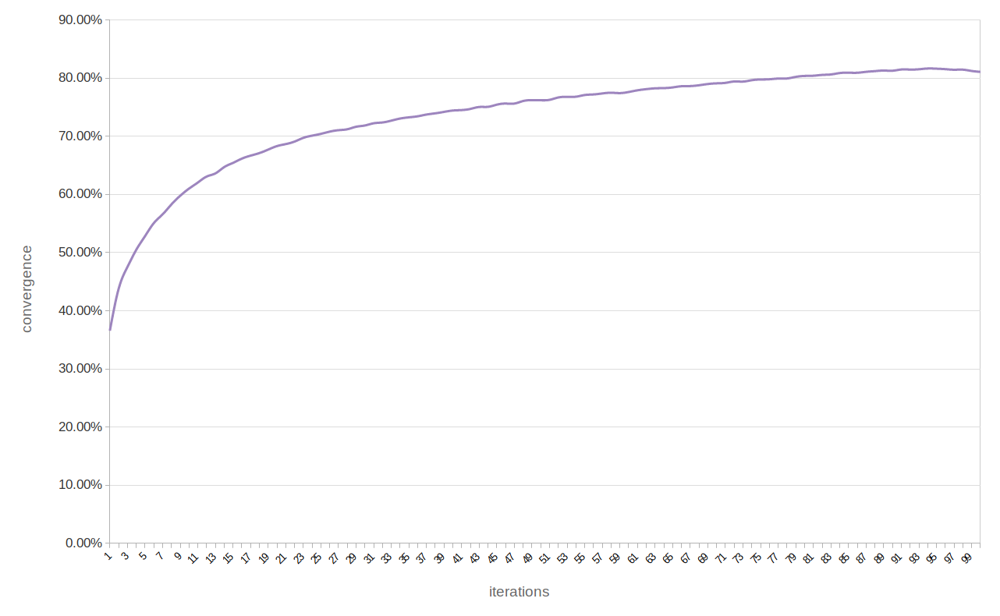

# Braint: Tweeter Emotion classifier


### Structure and Explanation
__Tokenizer__ a class to tokenize the Tweet texts. Currently the tweet text is split at whitespace characters and punctuation is treated as separate token.
Two functions are implemented:

- __get_tokens(text:str)__: returns a list of every token of the text
- __get_terms(text:str)__: returns a list of types

__Featurer__ a class to extract features from Tweet texts. Currently implemented is the tf-idf feature.

- This class is initialized with the Corpus from which features should be extracted.
- __set\_features()__: sets extracts the features from the Tweets and stores the features as a dictionary (key:feature\_name; value:tf-idf) in the Tweet object
- a list all feature labels is sent to Corpus using the method __set_all_feature_names()__ of the latter (this list is used by the perceptron to initiate weights)

__MultiClassPerceptron__ a class to train and test a classifier.

- This class is initialized with a list of all possible classes as well as a list of all feature names occurring in the training data.
- __train(num\_iterations, train\_corpus)__: num\_iterations determines the number of passes through the training data; for each Tweet in the train\_corpus the class of the Tweet is predicted using its feature and if necessary the weight are adjusted
- __test(test\_corpus)__: for each Tweet in the test\_corpus the class of the Tweet is predicted and the predicted label is stored in the Tweet object

## Classifier Experiment

### Data

For the most of the training we used the data provided by the [shared task](http://implicitemotions.wassa2018.com/data/ ) (we didn't yet have access to the main train data):

	- Training data: train.csv
	- Test data: trial.csv and trial.labels

For the experiment with the learning rate and 100 iterations (see under [Discussion](#discussion)) we used the main `train.csv` file with 153,600 labeled tweets. We split this file into __80% train__ data and __20% test__ data using the following commands:

```
head -n 30720 train.csv > test
tail -n +30721 train.csv > train
```
All of these files should be located in the subfolder `data`.

### Features

- A vector representation of tf-idf score for all terms in the collection.

### Results

#### Overview (only Fscores)

| Number of train iterations | Macro Fscore on test set | Micro Fscore on test set |
|----------------------------|--------------------------|--------------------------|
| 1 iteration                | 0.422                    | 0.433                    |
| 5 iterations               | 0.328                    | 0.389                    |
| 10 iterations              | 0.411                    | 0.425                    |
| 100 iterations*						 | 0.400										| 0.399										 |

\*Note that here we used the main train data and an adaptive learning rate (see explanation under [Data](#data) and [Discussion](#discussion)).

#### Detail (including Precision and Recall for each class)

- 1 iteration:

	```
	Fmac	Fmic	supP	supR	disP	disR	feaP	feaR	sadP	sadR	joyP	joyR	angP	angR
	0.422   0.433	0.46	0.35	0.47	0.54	0.39	0.59	0.38	0.56	0.68	0.22	0.43	0.33
	```

- 5 iterations:

	```
	Fmac	Fmic	supP	supR	disP	disR	feaP	feaR	sadP	sadR	joyP	joyR	angP	angR
	0.382   0.389	0.26	0.83	0.57	0.37	0.64	0.28	0.53	0.27	0.68	0.19	0.4	0.4
	```

- 10 iterations:

	```
	Fmac	Fmic	supP	supR	disP	disR	feaP	feaR	sadP	sadR	joyP	joyR	angP	angR
	0.411   0.425	0.34	0.62	0.37	0.66	0.6	0.31	0.51	0.26	0.5	 0.49	0.54	0.21
	```

- 100 iterations:

	```
	Fmac	Fmic	supP	supR	disP	disR	feaP	feaR	sadP	sadR	joyP	joyR	angP	angR
	0.4     0.399	0.35	0.4	0.48	0.42	0.44	0.43	0.36	0.32	0.47 	0.4	0.33	0.41
	```


#### Convergence

Convergence of the model with 100 iterations. A adaptive learning rate (`0 < n ≤ 1`) was applied in this case, i.e. starting with `1.0`, the learning rate was decreased by `0.01` after each iteration.

By convergence we mean here how well the model was predicting during `training phase`. 80% convergence, for example, means that 80% of the tweets during the last iteration were predicted correctly. This does not reflect how well the model will predict the test (unseen) data!



#### Discussion

We trained and tested the model several times with different number of iterations. During the 100 iterations experiment we used a learning rate that decreases during training (see description under [Convergence](#convergence)). In this scenario the model converged `81.09%` after the last iteration of training. To compare, with a static learning rate of `1.0` and with only `1` iteration the model converged `36.56%`. However with a higher convergence the model did not perform better on the test data, we even got a slightly worse f-measure (`Fmac: 0.4, Fmic:	0.399`).

Our conclusion from this observation is that our feature set does not allow a better prediction rate. We think that we should filter out certain words (eg. stopwords) and extract additional features (eg. number of capitalized words, biwords, etc..).
