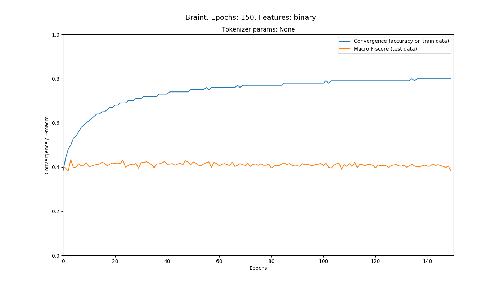
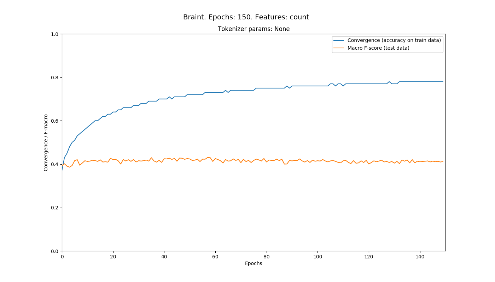
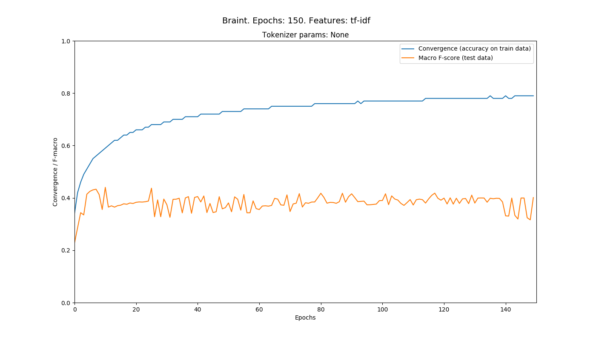
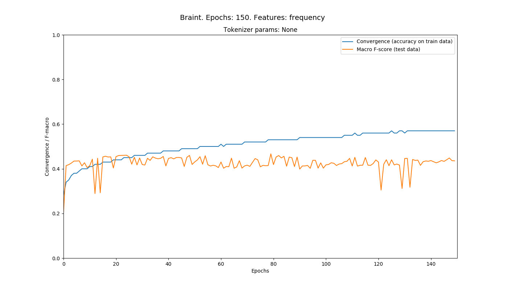
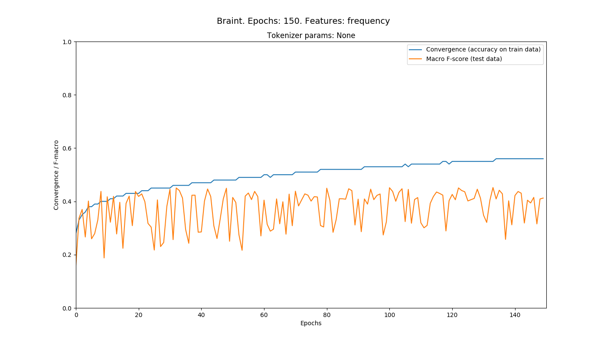
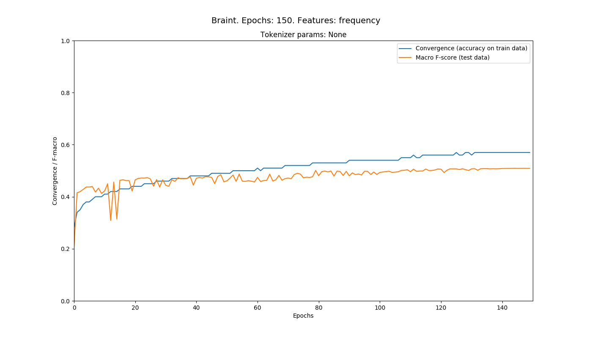
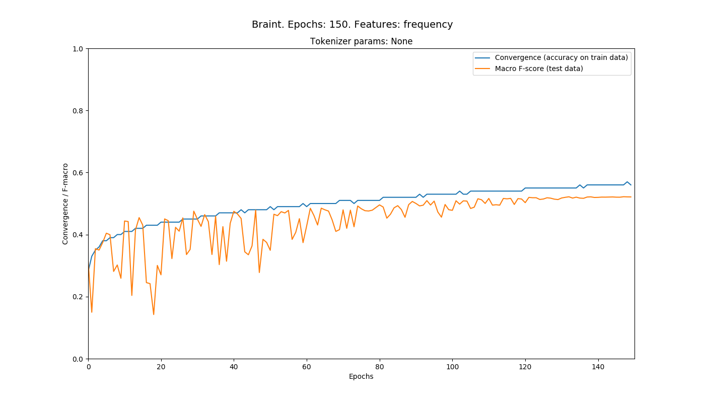

# Braint: Experiments

Here we include the evaluation results of our model run with different features
and parameters.

## Summary

 Summary contains an overview of all experiments.

### Experiments with Unigrams

 | Model             | LR             | Feature(s)       | Tokenization     | Epochs           | Conv             | Macro F          |
 |-------------------|----------------|------------------|------------------|------------------|------------------|------------------|
 | Baseline	         | 0.1            | binary           | Basic (split by space / punct)| 150 | 0.8              | 0.382            |
 | Baseline	         | 0.1            | count            | Basic            | 150              | 0.78             | 0.412            |
 | Baseline	         | 0.1            | tf-idf           | Basic            | 150              | 0.79             | 0.401            |
 | Baseline	         | 0.1            | frequency        | Basic            | 150              | 0.57             | 0.436            |
 | +Shuffle	         | 0.1            | frequency        | Basic            | 150              | 0.57             | 0.436            |
 | +Avg	             | 0.1            | frequency        | Basic            | 150              | 0.57             | 0.509            |
 | +Shuffle, +Avg	   | 0.1            | frequency        | Basic            | 150              | 0.56             | 0.52             |
 | +Shuffle, +Avg  	 | 0.5            | frequency        | Basic            | 150              | 0.56             | 0.521             |


### Experiments with Birgrams

| Model             | LR             | Feature(s)       | Tokenization     | Epochs           | Conv             | Macro F          |
|-------------------|----------------|------------------|------------------|------------------|------------------|------------------|
| Baseline | 0.1 | Bigram (frequency) | Basic | | | |
| Baseline | 0.1 | Bigram  | Lowercase | | | |
| Baseline | 0.1 | Bigram  | Remove stopwords | | | |
| Baseline | 0.1 | Bigram  | Stem | | | |
| Baseline | 0.1 | Bigram  | Convert emojis & emoticons | | | | |


## Details & Charts
### Binary. Tokenization: basic



150th epoch results:

```
Conv	Fmac	Fmic	supP	supR	disP	disR	feaP	feaR	sadP	sadR	joyP	joyR	angP	angR
0.8	0.382	0.388	0.28	0.68	0.54	0.37	0.42	0.46	0.43	0.29	0.54	0.3	0.41	0.22
```


### Count. Tokenization: basic



150th epoch results:

```
Conv	Fmac	Fmic	supP	supR	disP	disR	feaP	feaR	sadP	sadR	joyP	joyR	angP	angR
0.78	0.412	0.413	0.33	0.53	0.49	0.45	0.45	0.48	0.42	0.33	0.51	0.33	0.37	0.35
```


### TF-IDF. Tokenization: basic



150th epoch results:

```
Conv	Fmac	Fmic	supP	supR	disP	disR	feaP	feaR	sadP	sadR	joyP	joyR	angP	angR
0.79	0.401	0.411	0.31	0.63	0.41	0.59	0.54	0.36	0.43	0.38	0.61	0.29	0.45	0.2
```


### Frequency. Tokenization: basic



150th epoch results:

```
Conv	Fmac	Fmic	supP	supR	disP	disR	feaP	feaR	sadP	sadR	joyP	joyR	angP	angR
0.57	0.436	0.463	0.63	0.18	0.42	0.69	0.45	0.64	0.6	0.2	0.51	0.61	0.41	0.46
```


### Frequency. Tokenization: basic, +Shuffling



150th epoch results:

```
Conv	Fmac	Fmic	supP	supR	disP	disR	feaP	feaR	sadP	sadR	joyP	joyR	angP	angR
0.56	0.412	0.437	0.4	0.57	0.86	0.2	0.52	0.54	0.36	0.68	0.86	0.14	0.39	0.49
```


### Frequency. Tokenization: basic, +Averaging



150th epoch results:

```
Conv	Fmac	Fmic	supP	supR	disP	disR	feaP	feaR	sadP	sadR	joyP	joyR	angP	angR
0.57	0.509	0.51	0.46	0.5	0.56	0.56	0.53	0.56	0.48	0.45	0.57	0.55	0.45	0.43
```

### Frequency. Tokenization: basic, +Averaging+Shuffling


150th epoch results:

```
Conv	Fmac	Fmic	supP	supR	disP	disR	feaP	feaR	sadP	sadR	joyP	joyR	angP	angR
0.56	0.52	0.521	0.47	0.51	0.57	0.58	0.55	0.58	0.5	0.46	0.57	0.56	0.47	0.44
```


### Frequency. Tokenization: basic, +Averaging+Shuffling. LR: 0.5



150th epoch results:

```
Conv	Fmac	Fmic	supP	supR	disP	disR	feaP	feaR	sadP	sadR	joyP	joyR	angP	angR
0.56	0.521	0.522	0.47	0.51	0.57	0.58	0.55	0.58	0.5	0.46	0.57	0.56	0.47	0.44
```
