# Braint: Experiments

Here we include the evaluation results of our model run with different features
and parameters.

## Summary

 Summary contains an overview of all experiments.

### Experiments with Unigrams

 | Model             | LR     | Feature(s)    | Tokenization     | Epochs     | Conv    | __Macro F__  |
 |-------------------|--------|---------------|------------------|------------|---------|--------------|
 | Baseline	         | 0.1    | binary     | Basic (split by space / punct)| 150 | 0.8  | __0.382__    |
 | Baseline	         | 0.1    | count         | Basic            | 150        | 0.78    | __0.412__    |
 | Baseline	         | 0.1    | frequency     | Basic            | 150        | 0.57    | __0.436__    |
 | +Shuffle	         | 0.1    | frequency     | Basic            | 150        | 0.57    | __0.436__    |
 | +Avg	             | 0.1    | frequency     | Basic            | 150        | 0.57    | __0.509__    |
 | +Shuffle, +Avg	   | 0.1    | frequency     | Basic            | 150        | 0.56    | __0.52__     |
 | +Shuffle, +Avg	   | 0.3    | frequency     | Basic            | 150        | 0.56    | __0.521__    |
 | +Shuffle, +Avg  	 | 0.5    | frequency     | Basic            | 150        | 0.56    | __0.521__    |
 | +Shuffle, +Avg  	 | 1.0    | frequency     | Basic            | 150        | 0.56    | __0.521__    |
 | +Shuffle, +Avg  	 | 0.3    | frequency     | replace_emojis   | 150        | 0.55    | __0.511__    |
 | +Shuffle, +Avg  	 | 0.3    | frequency     | replace_num      | 150        | 0.56    | __0.52__     |
 | +Shuffle, +Avg | 0.3 | frequency | replace_emojis, replace_num | 150       | 0.55    | __0.51__     |
 | +Shuffle, +Avg  	 | 0.3    | frequency     | remove_stopw     | 150        | 0.52    | __0.47__     |
 | +Shuffle, +Avg  	 | 0.3    | frequency     | remove_punc      | 150        | 0.56    | __0.518__    |
 | +Shuffle, +Avg  	 | 0.3    | frequency     | lowercase        | 150        | 0.48    | __0.498__    |
 | +Shuffle, +Avg  	 | 0.3    | frequency     | stem             | 150        | 0.41    | __0.455__    |
 | +Shuffle, +Avg  	 | 0.3    | frequency     | all params       | 150        | 0.34    | __0.387__    |
 | Baseline	         | 0.1    | tf-idf        | Basic            | 150        | 0.79    | __0.401__    |
 | +Avg              | 0.3    | tf-idf        | Basic            | 150        | 0.79    | __0.467__    |
 | +Shuffle, +Avg    | 0.3    | tf-idf        | Basic            | 150        | 0.77    | __0.472__    |
 | +Shuffle, +Avg  	 | 0.3    | if-idf        | replace_emojis, replace_num | 150 | 0.76| __0.461__    |
 | +Shuffle, +Avg  	 | 0.3    | if-idf        | all params       | 150        | 0.43    | __0.376__    |


### Experiments with Birgrams

| Model             | LR     | Feature(s)    | Tokenization     | Epochs     | Conv    | __Macro F__  |
|-------------------|--------|---------------|------------------|------------|---------|--------------|
| Baseline | 0.1 | Bigram (frequency) | | | | |
| Baseline | 0.1 | Bigram  |  | | | | |


## Details & Charts
### Binary. Tokenization: basic


150th epoch results:

```
Conv	Fmac	Fmic	supP	supR	disP	disR	feaP	feaR	sadP	sadR	joyP	joyR	angP	angR
0.8	0.382	0.388	0.28	0.68	0.54	0.37	0.42	0.46	0.43	0.29	0.54	0.3	0.41	0.22
```


### Count. Tokenization: basic


150th epoch results:

```
Conv	Fmac	Fmic	supP	supR	disP	disR	feaP	feaR	sadP	sadR	joyP	joyR	angP	angR
0.78	0.412	0.413	0.33	0.53	0.49	0.45	0.45	0.48	0.42	0.33	0.51	0.33	0.37	0.35
```


### Frequency. Tokenization: basic


150th epoch results:

```
Conv	Fmac	Fmic	supP	supR	disP	disR	feaP	feaR	sadP	sadR	joyP	joyR	angP	angR
0.57	0.436	0.463	0.63	0.18	0.42	0.69	0.45	0.64	0.6	0.2	0.51	0.61	0.41	0.46
```


### Frequency. Tokenization: basic, MCP+Shuffling


150th epoch results:

```
Conv	Fmac	Fmic	supP	supR	disP	disR	feaP	feaR	sadP	sadR	joyP	joyR	angP	angR
0.56	0.412	0.437	0.4	0.57	0.86	0.2	0.52	0.54	0.36	0.68	0.86	0.14	0.39	0.49
```


### Frequency. Tokenization: basic, MCP+Averaging


150th epoch results:

```
Conv	Fmac	Fmic	supP	supR	disP	disR	feaP	feaR	sadP	sadR	joyP	joyR	angP	angR
0.57	0.509	0.51	0.46	0.5	0.56	0.56	0.53	0.56	0.48	0.45	0.57	0.55	0.45	0.43
```

### Frequency. Tokenization: basic, MCP+Averaging+Shuffling

#### Learning rate 0.1


150th epoch results:

```
Conv	Fmac	Fmic	supP	supR	disP	disR	feaP	feaR	sadP	sadR	joyP	joyR	angP	angR
0.56	0.52	0.521	0.47	0.51	0.57	0.58	0.55	0.58	0.5	0.46	0.57	0.56	0.47	0.44
```

#### Learning rate 0.3
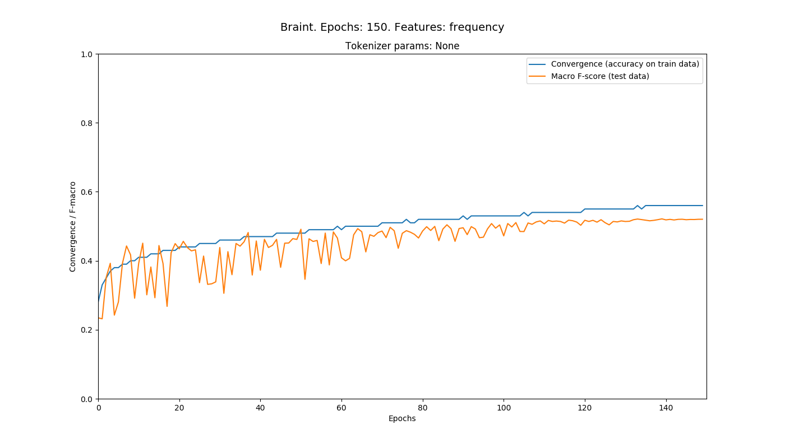

150th epoch results:

```
Conv	Fmac	Fmic	supP	supR	disP	disR	feaP	feaR	sadP	sadR	joyP	joyR	angP	angR
0.56	0.521	0.522	0.47	0.51	0.57	0.58	0.55	0.58	0.5	0.46	0.57	0.56	0.47	0.44
```

#### Learning rate 0.5:


150th epoch results

```
Conv	Fmac	Fmic	supP	supR	disP	disR	feaP	feaR	sadP	sadR	joyP	joyR	angP	angR
0.56	0.521	0.522	0.47	0.51	0.57	0.58	0.55	0.58	0.5	0.46	0.57	0.56	0.47	0.44
```

#### Learning rate 1.0:


150th epoch results

```
Conv	Fmac	Fmic	supP	supR	disP	disR	feaP	feaR	sadP	sadR	joyP	joyR	angP	angR
0.56	0.521	0.522	0.48	0.51	0.57	0.58	0.55	0.58	0.5	0.46	0.57	0.56	0.47	0.44
```


### Frequency. MCP+Averaging+Shuffling. Different tokenization params

Learning rate 0.3

#### replace_emojis

Emoticons and emojis are replaced by a lexical entity (e.g. ":)" -> "smile")

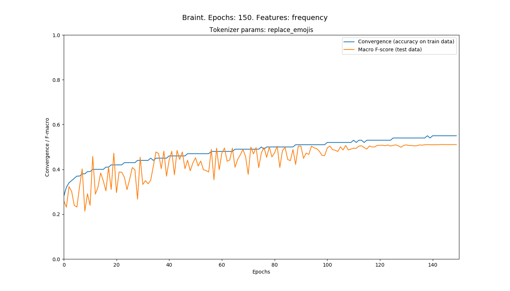

150th epoch results:

```
Conv	Fmac	Fmic	supP	supR	disP	disR	feaP	feaR	sadP	sadR	joyP	joyR	angP	angR
0.55	0.511	0.512	0.47	0.51	0.57	0.56	0.54	0.58	0.46	0.44	0.56	0.54	0.46	0.43
```

#### replace_num

Numerical tokens are replaced by <NUM\> tag

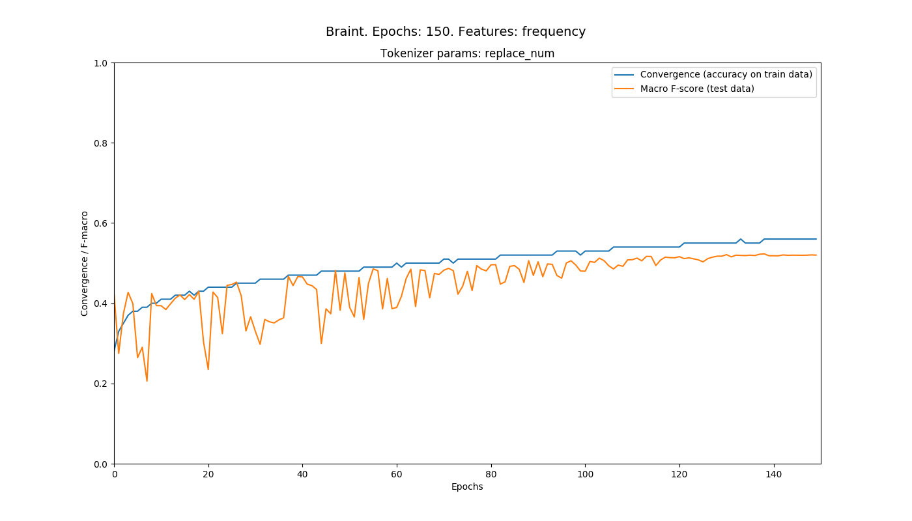

150th epoch results:

```
Conv	Fmac	Fmic	supP	supR	disP	disR	feaP	feaR	sadP	sadR	joyP	joyR	angP	angR
0.56	0.52	0.521	0.47	0.51	0.57	0.58	0.55	0.58	0.5	0.46	0.57	0.56	0.47	0.44
```

#### replace_emojis & replace_num

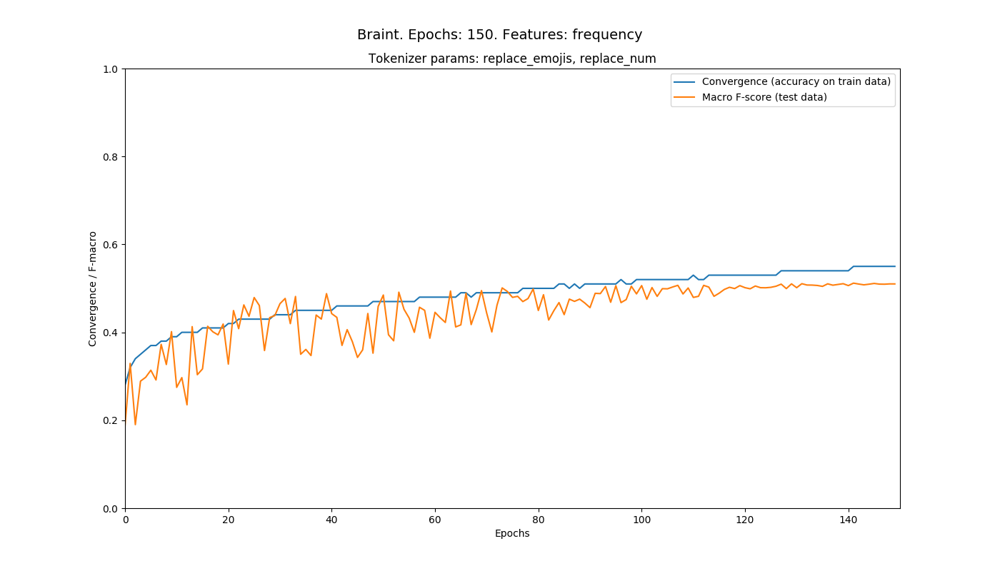

150th epoch results:

```
Conv	Fmac	Fmic	supP	supR	disP	disR	feaP	feaR	sadP	sadR	joyP	joyR	angP	angR
0.55	0.51	0.511	0.47	0.51	0.57	0.56	0.54	0.58	0.47	0.44	0.56	0.54	0.45	0.43
```

#### remove_punc

Remove punctuation during tokenization


150th epoch results:

```
Conv	Fmac	Fmic	supP	supR	disP	disR	feaP	feaR	sadP	sadR	joyP	joyR	angP	angR
0.56	0.518	0.519	0.47	0.51	0.57	0.58	0.54	0.58	0.5	0.45	0.57	0.55	0.46	0.44
```

#### remove_stopw

Remove stopwords

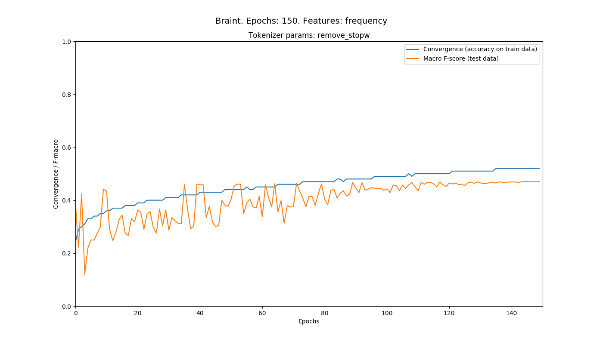

150th epoch results:

```
Conv	Fmac	Fmic	supP	supR	disP	disR	feaP	feaR	sadP	sadR	joyP	joyR	angP	angR
0.52	0.47	0.47	0.41	0.47	0.55	0.53	0.48	0.5	0.42	0.39	0.54	0.51	0.44	0.42
```

#### stem

Stem tokens

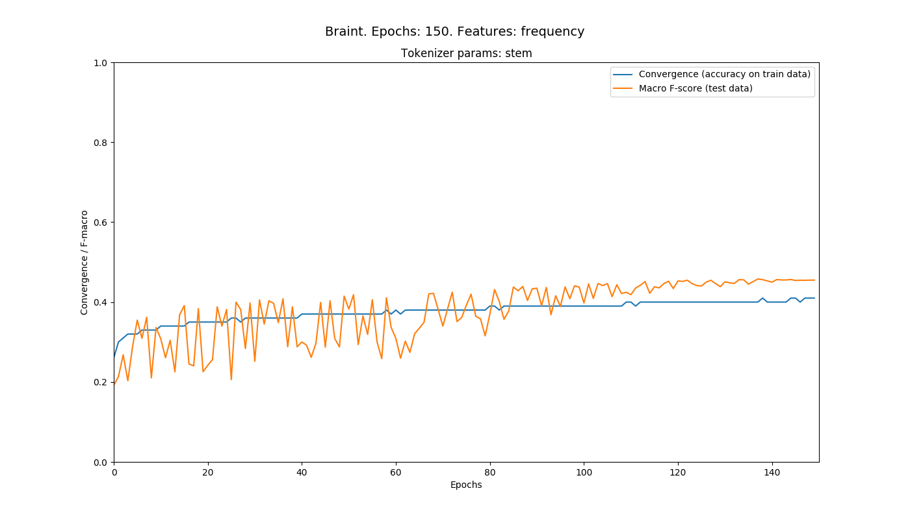

150th epoch results:

```
Conv	Fmac	Fmic	supP	supR	disP	disR	feaP	feaR	sadP	sadR	joyP	joyR	angP	angR
0.41	0.455	0.457	0.4	0.48	0.49	0.49	0.48	0.52	0.44	0.39	0.52	0.53	0.41	0.32
```

#### lowercase

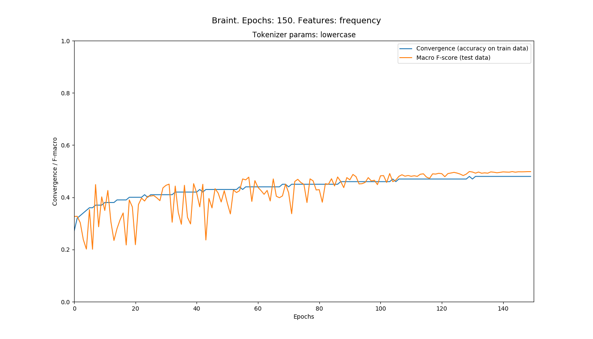

150th epoch results:

```
Conv	Fmac	Fmic	supP	supR	disP	disR	feaP	feaR	sadP	sadR	joyP	joyR	angP	angR
0.48	0.498	0.499	0.44	0.51	0.56	0.54	0.52	0.56	0.46	0.43	0.56	0.54	0.45	0.41
```


### Frequency. Tokenization: all params, MCP+Averaging+Shuffling

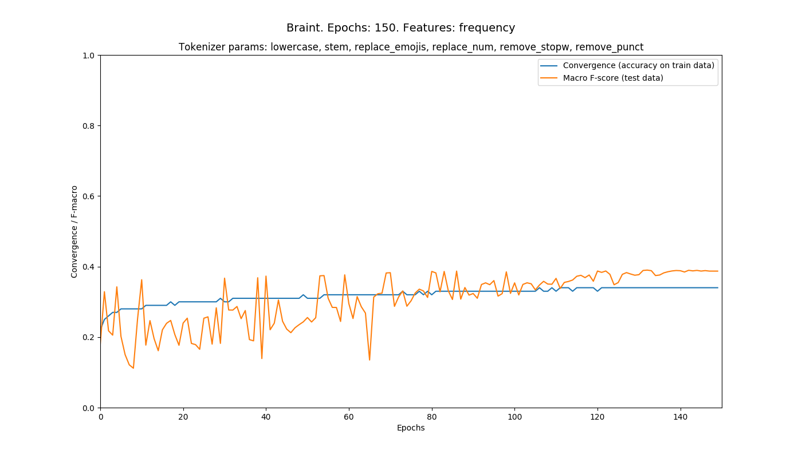

150th epoch results:

```
Conv	Fmac	Fmic	supP	supR	disP	disR	feaP	feaR	sadP	sadR	joyP	joyR	angP	angR
0.34	0.387	0.39	0.32	0.46	0.48	0.4	0.43	0.44	0.36	0.26	0.42	0.46	0.36	0.31
```


### TF-IDF. Different parametres


#### Model: Baseline, Tokenization: Basic:


150th epoch results:

```
Conv	Fmac	Fmic	supP	supR	disP	disR	feaP	feaR	sadP	sadR	joyP	joyR	angP	angR
0.79	0.401	0.411	0.31	0.63	0.41	0.59	0.54	0.36	0.43	0.38	0.61	0.29	0.45	0.2
```

#### Model: MCP+Averaging, Tokenization: Basic:

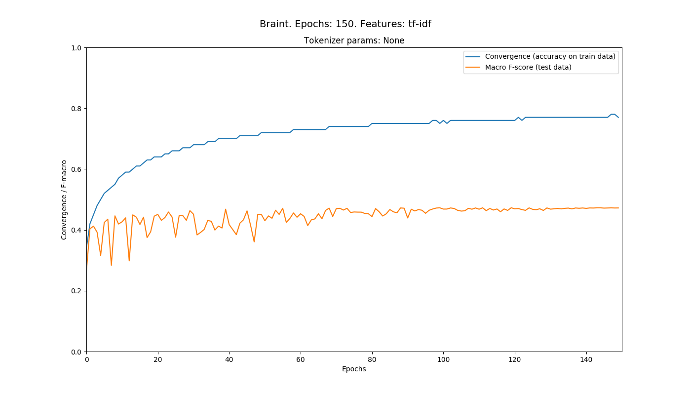

150th epoch results:

```
Conv	Fmac	Fmic	supP	supR	disP	disR	feaP	feaR	sadP	sadR	joyP	joyR	angP	angR
0.79	0.467	0.467	0.42	0.44	0.52	0.52	0.51	0.51	0.43	0.43	0.53	0.5	0.4	0.39
```

#### Model: MCP+Averaging+Shuffling, Tokenization: Basic:


150th epoch results:

```
Conv	Fmac	Fmic	supP	supR	disP	disR	feaP	feaR	sadP	sadR	joyP	joyR	angP	angR
0.77	0.472	0.473	0.42	0.44	0.53	0.53	0.51	0.52	0.44	0.43	0.53	0.51	0.41	0.4
```


#### Model: MCP+Averaging+Shuffling, Tokenization: all params:

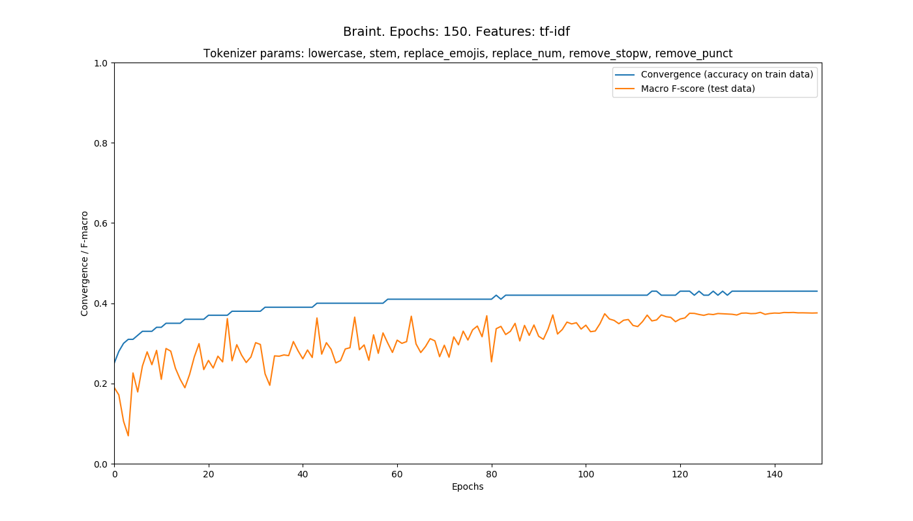

150th epoch results:

```
Conv	Fmac	Fmic	supP	supR	disP	disR	feaP	feaR	sadP	sadR	joyP	joyR	angP	angR
0.43	0.376	0.378	0.3	0.43	0.45	0.42	0.43	0.41	0.34	0.26	0.42	0.43	0.34	0.3
```


#### Model: MCP+Averaging+Shuffling, Tokenization: replace_emoji+replace_num:

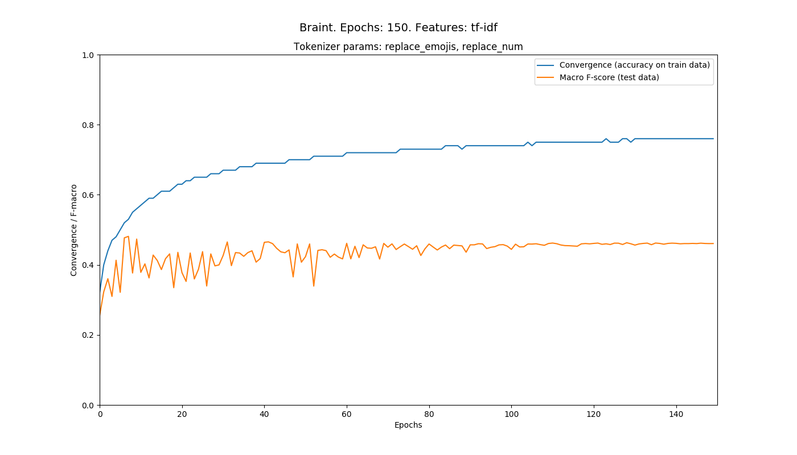

150th epoch results:

```
Conv	Fmac	Fmic	supP	supR	disP	disR	feaP	feaR	sadP	sadR	joyP	joyR	angP	angR
0.76	0.461	0.462	0.42	0.42	0.52	0.53	0.5	0.53	0.41	0.42	0.51	0.5	0.41	0.38
```
